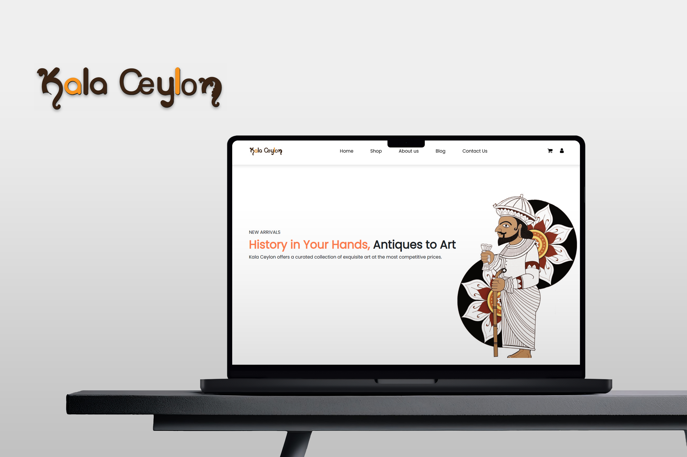

# KalaCeylon | E-Commerce Website

## Project Overview
**KalaCeylon** is an e-commerce website designed and developed as part of the Web Development course module. It showcases Sri Lankan heritage through paintings, antiques, and handmade products. This project was built to provide Ceylon Artistry with an online platform to expand its reach and generate online sales.

## Technologies Used
- **PHP**  
- **HTML**  
- **CSS**  
- **Bootstrap**  
- **JavaScript**  
- **XAMPP (for local server)**  
- **SQL**  

## Key Features
- **Responsive UI:** The website is designed to be mobile-friendly and accessible across devices.
- **Shopping Cart System:** Users can browse and add products to the shopping cart.
- **PayPal Integration:** Secure online payment gateway for purchases.
- **Dynamic Product Management:** Admin can manage products (add, edit, delete) dynamically.
- **User Management:** Admin can manage User Accounts (status, edit, delete) dynamically.

## Skills Gained
- Full-stack development  
- UI/UX design  
- Payment gateway integration  
- Web development best practices  

## License
This project is licensed under the [MIT License](LICENSE).
